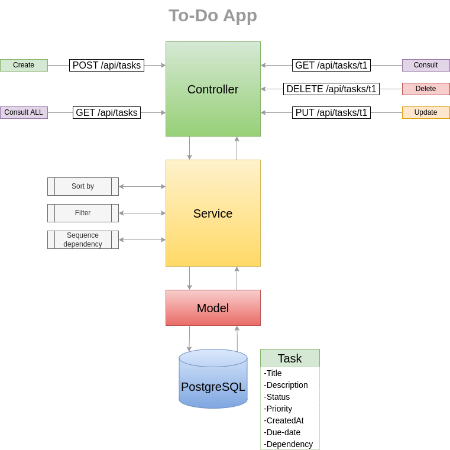

# API architecture


The Rest API implemented for this To-Do application follows the Controller-Service-Model pattern, where the process is modularized in 3 main layers.

## Controller
Provides the entrypoints for the RestAPI, and is responsible in forwarding the requests for the right services and to ensure the input and output patterns are in the right format.

## Service
Layer where the business logic is implemented. All the manipulation of data from database must be done in this layer before forwarded to the client, ensuring the request will be accomplished according expected logic defined by the business.

## Model
Layer that does the interactions with the database, providing a single point of access to the data.  

For this app the models provide functions for creating, querying, updating and deleting specific tasks. Below you can see an example of how to use the provided functions, which is the way the Service layer can execute actions that require data access.

```go

import (
	"time"
	"to-do-api/models"
)

// Initialize the database (clean all and create tables)
models.InitDatabase()

// Create new task
newTask := models.Task{Title: "new task", Description: "my description", Status: "backlog", Priority: 1, DueDate: time.Now().AddDate(0, 0, 7)}
models.CreateTask(newTask)

// Query data from taskId = 1
models.QueryTask(1)

// Update values from taskId = 1
updateTask := models.Task{Id: 1, Title: "new task", Description: "my description", Status: "backlog", Priority: 1, DueDate: time.Now().AddDate(0, 0, 7)}
models.UpdateTask(updateTask)

// Delete taskId = 2
models.DeleteTask(2)

```
